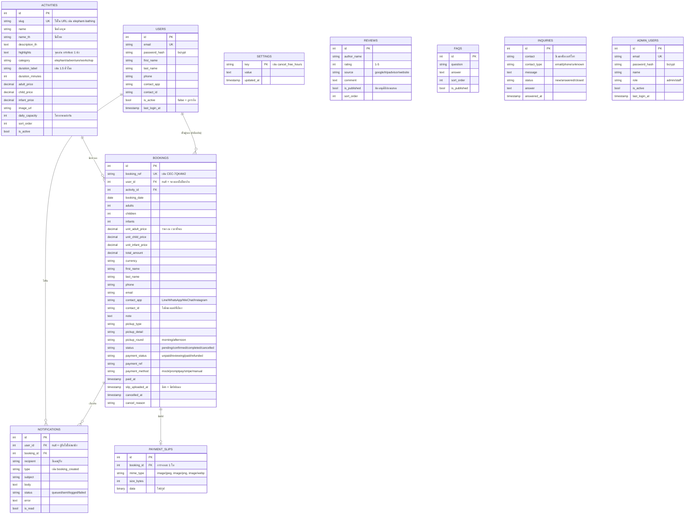

# โครงสร้างฐานข้อมูล

## ER Diagram



`REVIEWS`, `FAQS`, `INQUIRIES`, `ADMIN_USERS` และ `SETTINGS` ไม่มีความสัมพันธ์กับตารางอื่น
`BOOKINGS` อ้างถึง `ACTIVITIES` เสมอ และอ้างถึง `USERS` เมื่อผู้จองล็อกอินอยู่
ส่วน `NOTIFICATIONS` อ้างถึงทั้ง `USERS` และ `BOOKINGS` (ลบบัญชีหรือการจองแล้วการแจ้งเตือนที่เกี่ยวข้องถูกลบตาม)

ทุกตารางมี `created_at` และ `updated_at` ที่ตั้งค่าเริ่มต้นเป็นเวลาปัจจุบัน

---

## เหตุผลเบื้องหลังการออกแบบ

### ทำไม `bookings` ถึงเก็บราคาซ้ำ

คอลัมน์ `unit_adult_price`, `unit_child_price`, `unit_infant_price` เก็บราคาที่คัดลอกมาจาก
`activities` ณ วินาทีที่ลูกค้ากดจอง แม้จะดูเหมือนข้อมูลซ้ำซ้อน แต่จำเป็น

ถ้าไม่เก็บไว้ แล้วแอดมินขึ้นราคา Elephant Bathing จาก 1,290 เป็น 1,490 บาทในเดือนหน้า
การจองเก่าทั้งหมดที่คำนวณย้อนหลังจะได้ยอดใหม่ทันที ซึ่งไม่ตรงกับเงินที่ลูกค้าจ่ายไปจริง
การเก็บ snapshot ไว้ทำให้ประวัติการจองและรายงานรายได้ยังถูกต้องเสมอ

### `total_amount` คำนวณที่ไหน

คำนวณฝั่งเซิร์ฟเวอร์เท่านั้น ใน `backend/src/services/booking.service.js`
หน้าเว็บคำนวณยอดแสดงผลด้วยแต่เป็นเพียงการแสดงตัวอย่าง — ค่าที่บันทึกลงฐานข้อมูล
มาจากราคาในตาราง `activities` เสมอ ทำให้แก้ราคาผ่าน DevTools แล้วจ่ายถูกลงไม่ได้

### การนับที่ว่าง

```sql
SELECT SUM(adults + children)
FROM bookings
WHERE activity_id = ?
  AND booking_date = ?
  AND status IN ('pending', 'confirmed', 'completed');
```

- **ทารกไม่นับ** เพราะไม่ได้ใช้ที่นั่งแยก แต่บังคับว่าต้องมีผู้ใหญ่มาด้วยอย่างน้อย 1 คน
- **`pending` นับด้วย** เพราะการจองที่รอชำระเงินก็กันที่นั่งไว้แล้ว ไม่งั้นจะขายเกิน
- **`cancelled` ไม่นับ** ที่นั่งจึงคืนกลับสู่ระบบทันทีที่แอดมินกดยกเลิก

มี index `bookings_activity_date_idx` บน `(activity_id, booking_date)` รองรับ query นี้โดยตรง

### การกันจองพร้อมกันจนเกินโควตา

ถ้าเช็คที่ว่างแล้วค่อย insert แบบแยกกัน สองคนที่กดจองพร้อมกันอาจผ่านการเช็คทั้งคู่
แล้วยอดรวมเกินโควตา ระบบจึงทำทั้งสองขั้นใน transaction เดียวและล็อกแถวกิจกรรมก่อน

```js
const activity = await trx('activities').where({ slug }).forUpdate().first();
// ตั้งแต่บรรทัดนี้ไป transaction อื่นที่จองกิจกรรมเดียวกันจะรอจนกว่าจะ commit
const booked = await countBookedSeats(activity.id, date, trx);
```

`SELECT ... FOR UPDATE` ใช้ได้ทั้ง PostgreSQL และ MySQL

### สถานะและลำดับการเปลี่ยน

```
pending ──► confirmed ──► completed
   │            │
   └────────────┴──────► cancelled
```

บังคับลำดับไว้ที่ `ALLOWED_TRANSITIONS` ใน `booking.service.js` การข้ามขั้น เช่น
`pending → completed` จะถูกปฏิเสธด้วย HTTP 409 ป้องกันการกดผิดในหน้าแอดมิน
ที่จะทำให้ตัวเลขรายได้เพี้ยน

`payment_status` แยกจาก `status` เพราะลูกค้าอาจจ่ายเงินแล้วแต่ยังไม่ได้มาร่วมกิจกรรม
หรือยกเลิกหลังจ่ายแล้วซึ่งต้องบันทึกเป็น `refunded`

### ทำไมแยก `users` ออกจาก `admin_users`

ลูกค้ากับทีมงานเป็นคนละกลุ่มที่สิทธิ์ต่างกันโดยสิ้นเชิง การแยกตารางทำให้บัญชีลูกค้าไม่มีทางได้สิทธิ์หลังบ้าน
จากการแก้ค่า `role` ผิดพลาด token ของสองกลุ่มก็แยกชนิดกัน (`typ: user`) — token ลูกค้าเรียก `/api/admin/*` ไม่ได้

### ทำไม `bookings.user_id` เป็น null ได้

ลูกค้าจองได้โดยไม่ต้องสมัครสมาชิก การจองแบบนั้นผูกกับอีเมลอย่างเดียว เมื่อลูกค้าสมัครสมาชิกภายหลังด้วยอีเมลเดิม
ระบบจะเติม `user_id` ให้การจองเก่าทั้งหมด ถ้าบัญชีถูกลบ `user_id` จะกลับเป็น null (`ON DELETE SET NULL`)
ประวัติการจองของร้านจึงไม่หาย

### การชำระเงิน

`payment_status` แยกจาก `status` เพราะเป็นคนละเรื่องกัน — การจองที่ยกเลิกแล้วอาจยัง `paid` อยู่ (รอคืนเงิน)
เมื่อได้รับเงิน ระบบบันทึก `paid_at`, `payment_method` และ `payment_ref` แล้วขยับ `pending → confirmed` ให้อัตโนมัติ
ค่า `reviewing` ใช้กับ PromptPay เท่านั้น: ลูกค้าแจ้งว่าโอนแล้วแต่ระบบตรวจยอดเข้าบัญชีเองไม่ได้
จึงพักไว้ให้ทีมงานเช็กยอดแล้วเปลี่ยนเป็น `paid` เอง ข้อความที่ลูกค้าแจ้ง (เช่น เวลาที่โอน) เก็บใน `payment_ref`
การบันทึกรับเงินล็อกแถวการจองก่อน ถ้าเป็น `paid` อยู่แล้วจะไม่ทำซ้ำ จึงปลอดภัยเมื่อ webhook ยิงซ้ำ

### นโยบายยกเลิก

ลูกค้ายกเลิกเองได้เมื่อสถานะเป็น `pending` หรือ `confirmed` และเวลาปัจจุบันยังไม่ถึง
`booking_date 00:00 − cancel_free_hours` (ค่าเริ่มต้น 72 ชั่วโมง แก้ได้ในตาราง `settings`)
ทีมงานยกเลิกจากหน้าหลังบ้านได้เสมอโดยไม่ติดเงื่อนไขเวลา

### `settings` แบบ key-value

ค่าตั้งระบบมีไม่กี่ค่าและเพิ่มได้เรื่อย ๆ จึงเก็บเป็นแถวละ 1 ค่าแทนการเพิ่มคอลัมน์
รายการ key ที่ใช้ได้ ชนิดข้อมูล และค่าเริ่มต้น กำหนดไว้ที่ `backend/src/services/settings.service.js`
key ที่ไม่มีแถวในตารางจะใช้ค่าเริ่มต้น

### `notifications` เป็นทั้งบันทึกอีเมลและกล่องแจ้งเตือน

ทุกอีเมลที่ระบบส่งถูกบันทึกไว้ 1 แถว แถวที่มี `user_id` จะแสดงในหน้าบัญชีของลูกค้าด้วย
ส่วน `status` บอกผลการส่งอีเมลให้ทีมงานตรวจย้อนหลังได้ว่าฉบับไหนไม่ถึงลูกค้า

### ทำไม `inquiries` ถึงมี `contact` ช่องเดียว

ฟอร์มในหน้าเว็บ ("Your email or phone number") รับทั้งสองแบบในช่องเดียว
ระบบจึงเก็บค่าดิบไว้ใน `contact` แล้วเดาชนิดใส่ `contact_type` ให้ (`email` / `phone` / `unknown`)
แทนที่จะบังคับให้ผู้ใช้เลือกชนิดเอง

### รหัสการจอง

รูปแบบ `CEC-XXXXXX` โดย `X` สุ่มจากชุดอักขระ 32 ตัวที่ตัด `0`, `O`, `1`, `I` ออก
เพราะลูกค้าต้องอ่านรหัสนี้ทางโทรศัพท์และตัวอักษรเหล่านี้สับสนกันง่าย
ให้ความเป็นไปได้ 32⁶ ≈ 1,073 ล้านค่า และถ้าสุ่มชนของเดิมจริง ระบบจะสุ่มใหม่ให้อัตโนมัติสูงสุด 5 ครั้ง

---

## การแก้ไข schema

อย่าแก้ตารางด้วยมือใน DBeaver เพราะจะทำให้ฐานข้อมูลของแต่ละคนในทีมไม่ตรงกัน
ให้สร้างไฟล์ migration ใหม่แทน

```js
// backend/src/db/migrations/20260315120000_add_guide_language.js
export async function up(knex) {
  await knex.schema.alterTable('bookings', (table) => {
    table.string('guide_language', 20).notNullable().defaultTo('th');
  });
}

export async function down(knex) {
  await knex.schema.alterTable('bookings', (table) => {
    table.dropColumn('guide_language');
  });
}
```

ตั้งชื่อไฟล์ขึ้นต้นด้วย timestamp เพื่อให้รันตามลำดับ แล้วสั่ง

```bash
cd backend && npm run db:migrate
```

ถ้ารันผ่าน Docker เพียง `docker compose restart api` ก็พอ เพราะ API รัน migration ให้ตอนบูต
